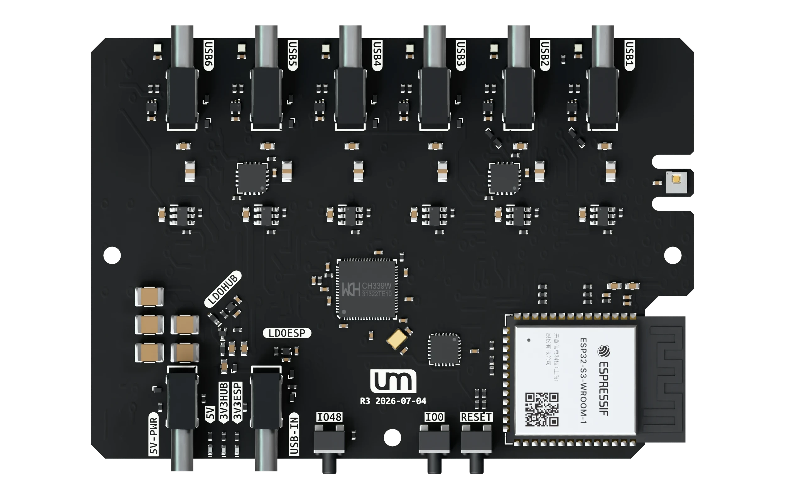

# Smart 6 Port USB Hub

**Automated testing. Automated device control.**

**Designed and made by [Unexpected Maker](https://unexpectedmaker.com) ·
[Get one from the store →](https://unexpectedmaker.com/shop/smarthub)**

Built for developers, test benches and USB devices that need to run unattended.
Smart USB Hub brings repeatable testing and everyday device routines to your
workbench, without the constant plugging, unplugging and reaching for cables.

## What it does

**Power cycling, scripted.** Use the REST API to switch a device's power, read
its voltage, current and power consumption, and check port status from your
test scripts. Repeat a startup test or compare readings across operating states
while the other devices stay powered.

**Every port, scheduled.** Set a different schedule for each port: selected
weekdays, a fixed run time, a chosen stop time or repeating intervals. Rules run
on the hub, so your browser doesn't need to stay open.

**Step in any time.** Open the web interface over Wi-Fi to switch an individual
port or investigate a device. Live readings show what it's drawing; connection
and fault status help you see why it isn't behaving as expected.

## Specifications

| | |
|---|---|
| Downstream | 6 × USB-C · USB 2.0 |
| Upstream | 1 × USB-C · USB 2.0 |
| Controller | ESP32-S3-WROOM-1 · 16 MB flash · 8 MB PSRAM |
| Port power | 5V USB-C input · 3A+ supply |
| 3V3 power | 2 × 3.3V LDOs · headroom for the ESP32-S3, hub chip, peripherals and LEDs |
| Protection | Per-port current limiting and over-current fault detection |
| Monitoring | Per-port voltage, current and power |
| Indicators | Per-port RGB status · power, device presence and faults |
| Environment | Onboard temperature and humidity sensor |
| Buttons | IO48 user button · IO0 / Boot · Reset |

## It's open source

Smart USB Hub is fully open source, so you can see exactly how it works, tweak
it to suit your bench, or build your own. Everything is in this repository:

| Folder | Contents |
|---|---|
| [`firmware/`](firmware/) | The PlatformIO project — building, flashing, first-time Wi-Fi setup and how to use the hub |
| [`hardware/`](hardware/) | KiCad 10 design files: schematic, PCB, footprints, 3D models and interactive BOM |
| [`docs/`](docs/) | Documentation: the [JSON / REST API reference](docs/rest_api.md) and [planned future updates](docs/future_updates.md) |
| [`step/`](step/) | STEP models of the board and the case, the light pipe insert, and the parts list for printing your own case |

Each folder has its own README with the details.

## Optional case

Add the case from the [store](https://unexpectedmaker.com/shop/smarthub) and
your hub goes from bare board to finished desk tool:

- **Matt black ABS** — a 3D printed enclosure that looks right at home on any
  bench
- **Laser cut light pipes** — every port's RGB status still shines through
- **Heat inserts + screws** — proper threads, so it goes together solid
- **Rubber feet** — it stays put when you plug and unplug

Or print your own from the files in [`step/`](step/) — its README covers the
light pipe insert and the screws, inserts and feet you'll need.

## Getting started

If you have a hub, start with **First-time setup** in the
[firmware README](firmware/README.md#first-time-setup). It gets the hub onto
your Wi-Fi so you can use the web interface.

## Licence

Copyright (c) 2026 [Unexpected Maker](https://unexpectedmaker.com).

| Part | Licence |
|---|---|
| Hardware (`hardware/`) and 3D files (`step/`) | [CERN-OHL-S v2](hardware/LICENSE) — strongly reciprocal: if you distribute the design, a modified version, or hardware made from it, you must publish the complete design source under the same licence |
| Firmware (`firmware/`) | [GPL-3.0-or-later](firmware/LICENSE) — use it, change it, put it in your own products; if you distribute it, you must publish the complete firmware source under the same licence. Bundled third-party code keeps its own licence (see the [firmware README](firmware/README.md#third-party-code)) |

Source location: <https://github.com/UnexpectedMaker/um_smart_usb_hub_6>
